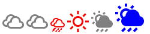

## Proof of Concept of SVG minification and layering using Gulp

An angular component for the icon ``` my-icon ```


Gulp task takes all the svgs under the svg folder minifies, layers (concats) the svgs and saves it under assets as 'icons.svg'

```
gulp.task('svg-icon-generator', function() {

    return gulp.src('./svgs/**/*.svg')
    .pipe(svgmin())
    .pipe(svgstore())
    .pipe(rename('icons.svg'))
    .pipe(gulp.dest('./assets'));

});

```

SVG's can be accessed as below. title tag is for accessibility

```
<svg class="icon" xmlns=http://www.w3.org/2000/svg role="img" >
    <title>cloudy</title>
    <use xlink:href="assets/icons.svg#cloudy"></use>
</svg>

```


Output

##### Angular Component

Base path of the svg is configured during the config phase using myIconConfigProvider

```
app.config(function(myIconConfigProvider){
    myIconConfigProvider.setBasePath('assets');
});

```


Component Markup


```
<my-icon file="common" icon="sunny" class="icon-24 icon-red" alt="Sunny"></my-icon>

```

* file - file name which contains the symbol/icon
* icon - symbol name of svg which corresponds to the filename
* class - optional classes to be added to svg in additional to .icon class
* alt - Accessibility text which is set as ```<title>```

css

```
.icon-24 {
    width: 24px;
    height: 24px
}

.icon-red {
    fill : red;
}

```

###### Parameters passed from controller

```
app.controller('myController', function($scope){
    var vm = this;

    vm.weather = {
        file : 'common',
        icon : 'rainy',
        class : 'icon-48 icon-blue',
        alt : 'rainy'
    }
});

```

```
<my-icon file="{{Ctrl.weather.file}}" icon="{{Ctrl.weather.icon}}" class="{{Ctrl.weather.class}}" alt="{{Ctrl.weather.alt}}"></my-icon>

```

#### Result


